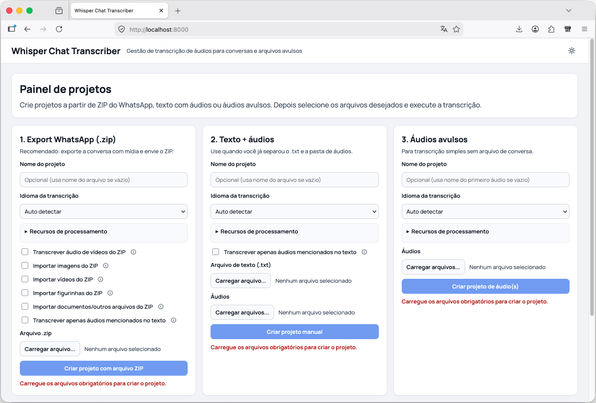
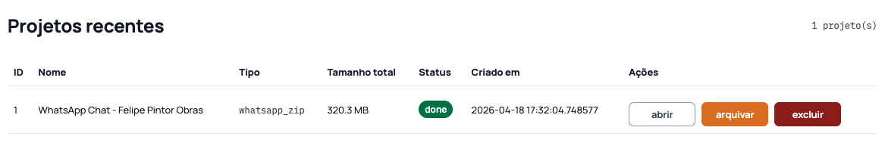
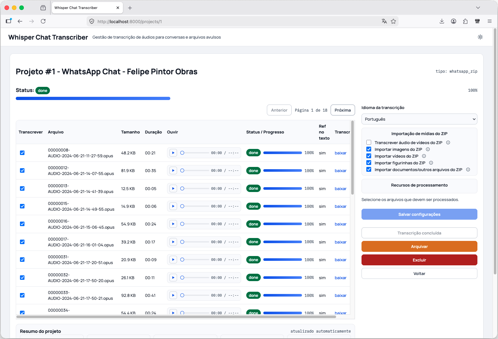
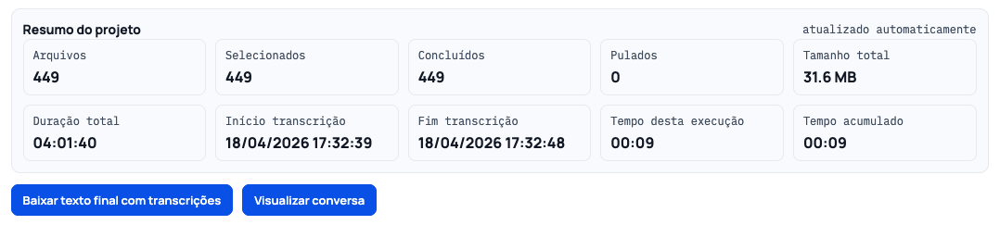
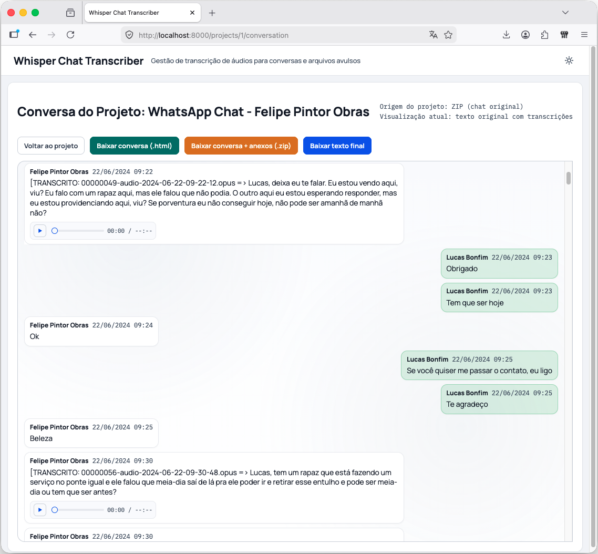

# Whisper Chat Transcriber

Aplicação web local para transformar áudios em texto dentro de conversas (ex.: WhatsApp), com exportação pronta para revisão e compartilhamento.

## O que este projeto resolve

Você tem uma conversa com muitos áudios e precisa:

- transcrever os áudios;
- manter cada transcrição salva por arquivo;
- gerar um texto final com as falas inseridas no ponto correto;
- visualizar a conversa em formato de chat;
- baixar a conversa em HTML (com ou sem anexos).

Tudo isso roda localmente na sua máquina.

## Para quem é

- Usuário que exportou conversa do WhatsApp em `.zip`;
- Usuário que tem `.txt` + pasta de áudios;
- Usuário com áudios avulsos, sem arquivo de conversa.

## Antes de começar

Você pode usar o projeto de 2 formas:

### Opção A: com Docker (mais simples)

Requisitos:

- Docker Desktop instalado (com Docker Compose).

### Opção B: sem Docker

Requisitos:

- Python 3.12
- FFmpeg instalado

## Início rápido (5 passos)

### 1) Baixe o projeto

Opção com Git:

```bash
git clone git@github.com:soulucasbonfim/whisper-chat-transcriber.git
cd whisper-chat-transcriber
```

Ou sem Git:

1. No GitHub, clique em `Code` -> `Download ZIP`.
2. Extraia o arquivo.
3. Abra o terminal dentro da pasta extraída.

### 2) Inicialize o projeto

Opção A: com Docker (recomendado)

```bash
cp .env.example .env
docker compose up --build
```

Opção B: sem Docker

```bash
python3 -m venv .venv
source .venv/bin/activate
pip install -r requirements.txt
uvicorn app.main:app --reload
```

### 3) Abra no navegador

`http://localhost:8000`

### 4) Crie o projeto

Na página inicial, escolha um dos fluxos:

- `Export WhatsApp (.zip)`;
- `Texto + áudios`;
- `Áudios avulsos`.

### 5) Inicie a transcrição e exporte

Na página do projeto:

- clique em `Iniciar transcrição`, `Continuar transcrição` ou `Nova transcrição` (quando o projeto já tiver sido concluído);
- acompanhe o progresso;
- use os botões de download no final.

## Como usar cada opção (explicação simples)

### Idioma da transcrição

- `Auto detectar`: o sistema tenta identificar o idioma sozinho.
- Idioma fixo (`pt`, `en`, etc.): use quando já sabe o idioma principal dos áudios.

### Opções do ZIP (WhatsApp)

- `Transcrever áudio de vídeos do ZIP`:
  pega o áudio dos vídeos e também transcreve.
- `Importar imagens do ZIP`:
  inclui imagens na visualização/exportação da conversa.
- `Importar vídeos do ZIP`:
  inclui vídeos como anexo na conversa/exportação.
- `Importar figurinhas do ZIP`:
  inclui stickers/figurinhas na conversa/exportação.
- `Importar documentos/outros arquivos do ZIP`:
  inclui anexos de documento/outros arquivos com link.
- `Transcrever apenas áudios mencionados no texto`:
  processa só os áudios que realmente aparecem no chat.
- `Exibir players de áudio na conversa`:
  controla apenas a exibição dos players de áudio na conversa (não força nova transcrição por si só).
- `Exibir players de vídeo na conversa`:
  controla apenas a exibição dos players de vídeo na conversa (não força nova transcrição por si só).

## O que você pode baixar no final

- `Baixar texto final com transcrições`:
  arquivo `.txt` com a conversa e as transcrições inseridas.
- `Baixar texto final`:
  atalho para exportar o texto final do projeto em `.txt`.
- `Visualizar conversa`:
  leitura em formato de chat dentro do navegador.
- `Baixar conversa (.html)`:
  exporta só a conversa em HTML.
- `Salvar conversa em PDF`:
  usa o fluxo nativo de impressão do navegador (Safari, Firefox, Chrome, Edge) para salvar em PDF.
- `Baixar conversa + anexos (.zip)`:
  exporta HTML + anexos para abrir em outro computador.

Os arquivos de download usam o nome do projeto como base, com normalização para remover acentos e caracteres não recomendados em nome de arquivo.

## Comportamentos importantes

- Em projetos com status `processing`, `queued`, `stopping` ou `importing`, as ações de `Arquivar` e `Excluir` ficam desabilitadas.
- A exibição de players (áudio/vídeo) é independente do processamento de transcrição.

## Privacidade

- O processamento é local (na sua máquina).
- Áudios, textos e anexos ficam no diretório `data/`.
- Não há envio automático para API externa.

## Telas do sistema

### 1) Página inicial do projeto



### 2) Seção de projetos recentes



### 3) Tabela de transcrição (arquivos e status)



### 4) Resumo do projeto



### 5) Visualização da conversa



### 6) Opções de exportação


## Problemas comuns

### Não abre no navegador

- Se estiver usando Docker:
  verifique se o container está rodando (`docker ps`) e se a porta está correta no `docker-compose.yml` (ex.: `8000:8000` ou `9000:8000`).
- Se estiver sem Docker:
  confirme se o `uvicorn` está em execução no terminal.
- Acesse a porta configurada no navegador.

### Erro de nome de container já em uso

Se aparecer conflito de nome:

```bash
docker rm -f whisper-chat-transcriber-web
docker compose up --build
```

### Projeto grande ficou lento na conversa

Use a própria tela `Visualizar conversa`, que carrega as mensagens em blocos (não tudo de uma vez).

## Configurações avançadas (opcional)

Variáveis disponíveis em `.env.example`:

- `APP_APP_NAME`
- `APP_DATA_DIR`
- `APP_WHISPER_MODEL_SIZE`
- `APP_WHISPER_DEVICE`
- `APP_WHISPER_COMPUTE_TYPE`
- `APP_TRANSCRIPTION_WORKERS`
- `APP_TRANSCRIPTION_PROJECT_CONCURRENCY`
- `APP_TRANSCRIPTION_CHUNK_SECONDS`
- `APP_TRANSCRIPTION_ENABLE_SILENCE_TRIM`
- `APP_TRANSCRIPTION_CACHE_ENABLED`

## Estrutura de dados

Os projetos são salvos em:

- `data/projects/<id>/source`
- `data/projects/<id>/audios`
- `data/projects/<id>/media`
- `data/projects/<id>/transcripts`
- `data/projects/<id>/output`

Cache de transcrição:

- `data/transcription_cache/`

## Licença

Este projeto é distribuído sob a licença MIT.  
Consulte o arquivo [`LICENSE`](./LICENSE) para os termos completos.
